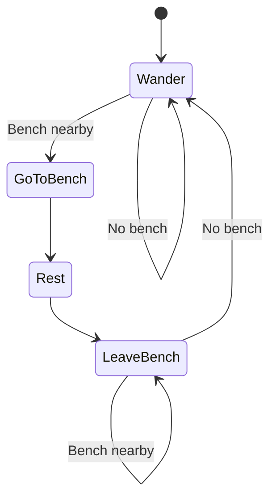

# Informe

1. [Controles](#controles)
2. [Apartados](#apartados)
    1. [Runners](#runners)
        1. [Camino](#camino)
        2. [Suavizado](#suavizado)
        3. [Código Runners](#código-runners)
        4. [Código seguir recorrido](#código-seguir-recorrido)
            1. [Código Delay](#código-delay)
            2. [Código Waypoints](#código-waypoints)
    2. [Abuelos](#abuelos)
        1. [Estados](#estados)
            1. [Cambios de estado](#cambios-de-estado)
            2. [Wander](#wander)
            3. [GoToBench](#gotobench)
            4. [Rest](#rest)
            5. [LeaveBench](#leavebench)
        2. [Código Abuelos](#código-abuelos)
            1. [GrandpaState](#grandpastate)
            2. [Código Ejecución Estados](#código-ejecución-estados)
            3. [Código Cambio de Estados](#código-cambio-de-estados)
            4. [Código addicional](#código-addicional)

[Repositorio](https://github.com/VeraMasc/IA-PEC1)

[Video](https://youtu.be/MQNjHo94NJs)

## Controles

- Desplazar la cámara con WASD
- Orientar la cámara moviendo el ratón
- Zoom con la ruedecita del ratón

## Apartados

### Runners

Implementados en [RunnerAi.cs](https://github.com/VeraMasc/IA-PEC1/tree/main/Assets/Scripts/AI/RunnerAi.cs). En el juego se ven como cápsulas de color rojo.

#### Camino

Para describir el camino hemos usado una lista de puntos en el mapa y una clase ([Waypoints](#código-waypoints)) que permite a los Runners obtener la siguiente parada de su recorrido en función de su última parada visitada y el sentido en el que realizan el recorrido.

Para seguir el recorrido simplemente marcamos el siguiente punto como destino del agente y cuando se acerca a este lo suficiente movemos el destino hacia el siguiente punto, así indefinidamente.

#### Suavizado

Para que los runners se muevan de forma fluida usamos una versión modificada del movimiento de los navmesh agents que unity usa por defecto para que implementa el suavizado por "ghost agent".

Concretamente, la modificación que hemos hecho altera como el objeto sigue el movimiento del agente simulado. En vez de hacer que la posición del Gameobject sea exactamente la misma que la del agente, hacemos que este siga al agente desde cierta distancia y siempre se aproxime a él a través del camino más corto. Ver en [Código Delay](#código-delay)

De esta forma logramos que los movimientos del agente, especialmente los giros, se traduzcan en movimientos más graduales por parte del Gameobject.

#### Código Runners

#### Código seguir recorrido

```cs
    /// <summary>
    /// Inicializa la posición del agente a cierta distancia para que no haya delay en el movimiento
    /// </summary>
    private void setAgentPos(){
        var diff = targetPoint.position-transform.position;
        var offsetPos = transform.position + diff.normalized * agentDelay;
        agent.nextPosition = offsetPos;
    }

    /// <summary>
    /// Abandona el path previo (si lo hay) y genera uno nuevo
    /// </summary>
    public void regeneratePath(){
        getNextTarget();

        if (targetPoint == null)
            return;

        agent.destination = targetPoint.position;
    }

    /// <summary>
    /// Cambia de target point si ya se ha llegado al actual
    /// </summary>
    public void getNextTarget(){
        if(targetPoint == null){
            (targetPoint, targetIndex) = Waypoints.singleton.getNextPoint(targetIndex, pathDir==1? 0:-1);
            setAgentPos();
            return;
        }

        (targetPoint, targetIndex) = Waypoints.singleton.getNextPoint(targetIndex,pathDir);
    }
```

##### Código Delay

```cs
    /// <summary>
    /// Actualiza la posición para que siga al agente desde una cierta distancia
    /// </summary>
    public void followAgent(){
        var pos =agent.nextPosition;
        var diff = pos-transform.position;
        
        if(diff.magnitude >=agentDelay){
            transform.position += diff.normalized * (diff.magnitude-agentDelay);
        }
    }

    /// <summary>
    /// Inicializa la posición del agente a cierta distancia para que no haya delay en el movimiento
    /// </summary>
    private void setAgentPos(){
        var diff = targetPoint.position-transform.position;
        var offsetPos = transform.position + diff.normalized * agentDelay;
        agent.nextPosition = offsetPos;
    }
```


##### Código Waypoints

Ver en el archivo [Waypoints.cs](https://github.com/VeraMasc/IA-PEC1/tree/main/Assets/Scripts/AI/Waypoints.cs)

```cs
/// <summary>
/// Singleton que controla los wayponts del recorrido de los runners
/// </summary>
public class Waypoints : MonoBehaviour
{

    public Transform[] waypointsList;

    private static Waypoints _singleton;
    ///<summary>GameManager Singleton</summary>
    public static Waypoints singleton
    {
        get 
        {
            if (_singleton == null)
            {
                _singleton = FindObjectOfType<Waypoints>(); //Para cuando el maldito hotreload me pierde la referencia
            }
            return _singleton;
        }
    }

    void Awake()
    {
        if(singleton!=null &&  singleton != this) //Prevent duplicate singleton
        {
            Destroy(this);
            return;
        }

        _singleton=this;
    }
    // Start is called before the first frame update
    void Start()
    {
        waypointsList = getWaypoints().ToArray();
    }

    /// <summary>
    /// Recupera una lista con todos los waypoints hijos
    /// </summary>
    public List<Transform> getWaypoints(){
        var ret = new List<Transform>();
            
            foreach (Transform child in transform) {
                ret.Add(child);

            }
            return ret;
    }

    /// <summary>
    /// Obtiene el siguiente punto en el recorrido de un runner
    /// </summary>
    /// <param name="current">Waypoint actual del runner</param>
    /// <param name="dir">Sentido de movimiento del runner (en la lista de waypoints)</param>
    /// <returns>Tuple of the point's Transform & it's index</returns>
    public (Transform, int) getNextPoint(int current, int dir){
        var index = (current + dir + waypointsList.Length) % waypointsList.Length;
        return (waypointsList[index], index);
    }

}
```

### Abuelos

Implementados en [GrandpaAi.cs](https://github.com/VeraMasc/IA-PEC1/tree/main/Assets/Scripts/AI/GrandpaAI.cs). En el juego se ven como cápsulas de color morado.

#### Estados

Los abuelos tienen 4 estados definidos en el enum [GrandpaState](#grandpastate). Estos son:

1. [Wander](#wander)
2. [GoToBench](#gotobench)
3. [Rest](#rest)
4. [LeaveBench](#leavebench)



##### Cambios de estado

Por cuestiones de simplicidad y eficiencia, los cambios de estado no se calculan en todo momento, sino solo cuando el estado actual ha finalizado su ejecución. Es decir, que o bien el agente ha llegado a su destino, o el tiempo de descanso en el banco se ha finalizado.

##### Wander

Es el estado base de los abuelos en el cual lo que hacen es simplemente deambular de forma aleatoria por el escenario. Para lograrlo, le damos al agente una posición de destino aleatoria pero relativamente cercana.

Una vez llegue a la posición de destino, ejecutará el cálculo del siguiente estado. Si encuentra un banco cerca, cambiará a [GoToBench](#gotobench), si no, reiniciará el estado [Wander](#wander).


##### GoToBench

En este estado lo que hacen es ir al banco más cercano e intentar "sentarse" en él. Hasta que detectan que están lo suficientemente cerca de la posición objetivo y que se encuentan encima de un banco (una navmesh area de tipo Bench), entonces pasan al estado [Rest](#rest).

##### Rest

Este es el estado en el que el abuelo se queda "descansando" en un banco. Para lograr este efecto sin que los abuelos se salgan del banco lo que hacemos es resetear el path del agent para que deje de moverse y le limitamos las navmesh areas por las que se puede mover a únicamente el área de los bancos.

De esta forma, aunque otro agente intente sentarse en el mismo banco, no se verá empujado fuera de este a la vez que tampoco se quedará "bloqueado" en el sitio sin dejar que otros agentes se sienten. Simplemente se dejará empujar a un lado del banco, dando la sensación de que le está "haciendo hueco" al otro agente para que se siente.

Una vez pasado el tiempo indicado de descanso, el estado cambia automáticamente a [LeaveBench](#leavebench)

##### LeaveBench

Este estado es casi indistinguible de Wander salvo por un leve matiz: cuando detecta un banco cerca, no se sienta, ya que el objetivo del estado es precisamente evitar posibles bucles en los que un abuelo no hace nada más que levantarse y volverse a sentar en el mismo banco o en otro cercano.

De no encontrar ningún banco cerca, el estado cambia a [Wander](#wander), de lo contrario, se mantiene en [LeaveBench](#leavebench) hasta "dejar atrás" los bancos y poder deambular un poco antes de volver a sentarse.

Podría haber implementado esta solución al problema de los abuelos que entran en bucle de muchas otras formas, desde probabilidades en el cambio de estado, hasta un "cooldown", una probablilidad que aumentara con el tiempo, etc. Pero ya que se hacía mucho hincapié en las máquinas de estados he pensado que añadir este estado era la más adecuada para este ejercicio.

#### Código Abuelos

> Por motivos de simplicidad y legiblidad, recomendaría mirar directamente el código en [GrandpaAi](https://github.com/VeraMasc/IA-PEC1/tree/main/Assets/Scripts/AI/GrandpaAI.cs). Está todo comentado y resulta mucho más legible

La ejecución de los estados frame por frame es realizada por **executeState**, pero en general estos no hacen gran cosa a parte de comprovar si se puede dar el estado actual por finalizado.

Lo verdaderamente importante son la funcione que decide el próximo estado (**getNextState**) y la que lo inicializa (**initializeState**), ya que la mayor parte del movimiento en sí está gestionada por el propio sistema de navmesh agents de unity. Ver en [Código Cambio de Estados](#código-cambio-de-estados)

##### GrandpaState

```cs
    /// <summary>
    /// Estados posibles de la máquina de estados de los "Abuelos"
    /// </summary>
    public enum GrandpaState{
    /// <summary>
    /// Deambulando
    /// </summary>
    wander,
    /// <summary>
    /// Yendo a descansar en un banco
    /// </summary>
    goToBench,
    /// <summary>
    /// Descansando en un banco
    /// </summary>
    rest,
    /// <summary>
    /// Yendo a descansar en un banco
    /// </summary>
    leaveBench,
}
```

##### Código Ejecución Estados

```cs
    /// <summary>
    /// Ejecuta el estado actual de la FSM
    /// </summary>
    private void executeState()
    {
        //Cambiar de estado automáticamente al terminar el path actual
        if(stateNeedsUpdate())
            state = getNextState();

        switch(state){
            case GrandpaState.leaveBench:
            case GrandpaState.wander:
                wander(); break;

            case GrandpaState.rest:
                rest(); break;
        }

        
    }

    /// <summary>
    /// Ejecuta el estado de deambular
    /// </summary>
    public void wander(){
        if (agent.hasPath && agent.remainingDistance > agent.stoppingDistance)
            return;
        
        var randomVector = Quaternion.FromToRotation(Vector3.forward,Vector3.up) * (Vector3)(Random.insideUnitCircle * wanderRange) + agent.velocity * wanderInertia;
        var minVector = randomVector.normalized * minWanderRange;
        if(minVector.magnitude > randomVector.magnitude) //Minimum movement
            randomVector = minVector; 
        agent.destination =  randomVector + transform.position;		
        
        
            
    }

    /// <summary>
    /// Ejecuta el estado de descanso
    /// </summary>
    public void rest(){
        restRemaining -= Time.deltaTime;
    }
```

##### Código Cambio de Estados

```cs
    /// <summary>
    /// Detecta si el estado actual se encuentra finalizado y ha de pasar al siguiente
    /// </summary>
    /// <returns>true si ha finalizado</returns>
    bool stateNeedsUpdate(){
        if ((!agent.hasPath || agent.remainingDistance <= agent.stoppingDistance) && state != GrandpaState.rest)
            return true;

        if(state == GrandpaState.goToBench && agent.remainingDistance <1f){
            return true;
        }

        if(state == GrandpaState.rest && restRemaining <0){
            return true;
        }

        return false;
    }

    /// <summary>
    /// Inicializa el nuevo estado solo cuando se produce un cambio
    /// (No se activa si se repite el mismo estado)
    /// </summary>
    /// <param name="newState">Próximo estado</param>
    void initializeState(GrandpaState newState){
        if (newState == GrandpaState.rest){
            agent.areaMask = benchMask; //Force to stay in bench
            restRemaining = restTime;
            agent.ResetPath();
        }else{

            if(newState == GrandpaState.leaveBench){
                agent.areaMask = defaultMask; //Allow to leave bench
                    
            }

        }
        
    }
```

##### Código addicional

```cs
/// <summary>
/// Datos del banco más cercano detectado
/// </summary>
public class ClosestBench{
    /// <summary>
    /// Collider del banco (si existe)
    /// </summary>
	public Collider hit;
    /// <summary>
    /// Distancia hasta el banco (si existe)
    /// </summary>
	public float dist;
}


    /// <summary>
    /// Detecta si hay algún banco cerca
    /// </summary>
    /// <param name="range">Radio en el que comprueba si hay un banco</param>
    /// <returns>Datos del banco más cercano</returns>
    public ClosestBench benchNearby(float range){
        var hits = Physics.OverlapSphere(transform.position, range, benchLayer);

        var closest = hits.Select(hit => 
            new ClosestBench{ hit=hit, dist=(hit.transform.position - transform.position).magnitude}//Calculate dist
        ).DefaultIfEmpty()
        .Aggregate((curMin, x) => curMin == null || x.dist  < curMin.dist ? x : curMin);

        if(closest != null){
            Debug.Log("Bench Hit");
        }

        return closest;
    }
```

