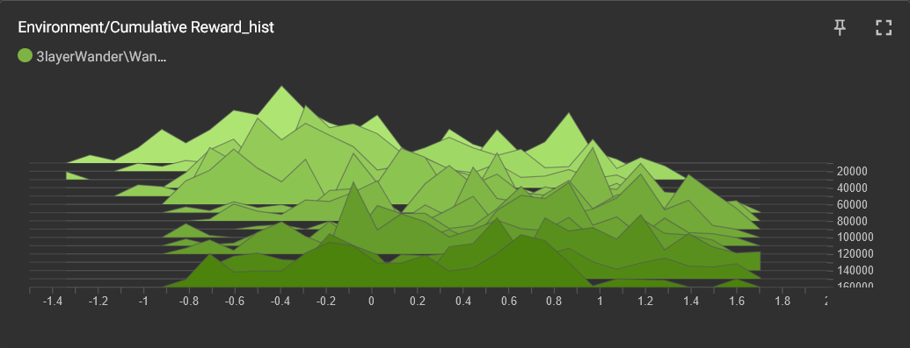

# Informe

1. [Apartados](#apartados)
    1. [Roller Ball](#roller-ball)
        1. [Tutorial](#tutorial)
        2. [Mejoras](#mejoras)
            1. [Cohete](#cohete)
            2. [Cohete v2](#cohete-v2)
    2. [Agente Plaza](#agente-plaza)
        1. [Sensores del agente](#sensores-del-agente)
        2. [Recompensas](#recompensas)
            1. [Valoración de los choques](#valoración-de-los-choques)
            2. [Valoración del camino realizado](#valoración-del-camino-realizado)
        3. [Problemas](#problemas)

## Apartados

### Roller Ball

#### Tutorial

#### Mejoras

##### Cohete

Como los resultados del ejemplo me parecían ya bastante buenos, he decidido complicar un poco el problema limitando la capacidad de controlar el movimiento del objeto. He hecho que solo se pueda controlar la velocidad con la que se mueve hacia adelante (no se puede parar) y su velocidad de rotación en el eje Y. Básicamente, que se comporte como un mísil, pero que se desplaza pegado al suelo. Está implementado en **RocketAgent**.

Al ser más complejo y requerir ciertos cambios en el entorno, he hecho mútiples pruebas y entrenamientos. Todos los modelos resultantes están inlcuidos en el proyecto e indicaré cómo probar cada uno.

Al principio partí del entorno de la esfera tal cual y tan solo modifiqué el número de inputs y el efecto de las acciones del agente. Podemos ver sus resultados en las gráficas en color azul claro.

Tras hacer esta primera prueba, decidí modificar la función de recompensa para intentar hacer que el agente diera menos vueltas sobre si mismo como una peonza y se comportara más como un misil que va directo al objetivo. Para lograrlo, añadí dos factores a la recompensa final: El número de pasos que ha costado llegar al objetivo (en escala logarítmica para siempre incentivar el ir más rápido) y el número de vueltas que ha dado sobre el eje Y para llegar (1 si ha hecho una o menos).

Dividiendo la puntuación en base a estos factores podemos darle una "nota" sobre 1 a su éxito. El resultado de entrenar al cohete con estas recompensas es el siguiente (en fucsia): 

En un principio puede parecer que los resultados son mucho peores, pero tenemos que tener en cuenta que ya no estamos dando un 1 solo por llegar y que le estamos exigiendo mucho más. Si miramos la distribución de las recompensas esto queda mucho más claro.

Podemos ver que, al igual que en la original, muy pocos de los intentos acaban recibiendo un 0, pero que en este caso la distribución de las recompensas es mucho mayor, pero con una tendencia al alza muy similar a la original. Es decir, que el aparente empeoramiento del aprendizaje no es real. Pero, se ha conseguido realmente el objetivo?

A continuación se puede ver una comparativa en la duración de los episodios con ambos modelos y se puede apreciar considerablemente lo súmamente rápido que desciende en el nuevo modelo comparado con el anterior y la ausencia de picos pronunciados. En este sentido el experimento ha sido todo un éxito

Sin embargo, al probar el modelo, he podido comprobar que sigue haciendo lo mismo: dar vueltas como un trompo hasta coger los cubos. Es mucho más eficiente, pero no se comporta como el mísil que yo deseaba. Analizando su comportamiento, me he dado cuenta de que probablemente esto se debe a el rango limitado en el que aparecen los cubos y el hecho de que el lateral del cohete ofrece mayor superficie de contacto. Es decir, el problema es que en el entorno de entrenamiento que he creado esta es la estrategia más eficiente.

##### Cohete v2

Insatisfecha con los resultados, he continuado haciendo pruebas y modificando el agente hasta obtener el comportamiento deseado.

En primer lugar, lo que he hecho es limitar el número de vueltas que el agente da en un episodio, pues para llegar a su objetivo no necesita más de una y el quedarse dando vueltas sobre un mismo sitio es una forma común de que el agente se quede atascado sin caer o llegar al objetivo, lo que alarga innecesariamente los episodios. Especialmente en el nuevo escenario que es el doble de grande que el anterior.

Al ver que esto no era suficiente, he decidido atajar el problema de raíz haciendo que dar vueltas sea una forma mucho más ineficiente de desplazarse. He añadido un drag rotatorio proporcional a la velocidad para hacer más difícil el girar a gran velocidad y he añadido un arrastre lateral muy fuerte para impedir que se desplace derrapando (y simular el mayor arrastre que tiene un cohete yendo de lado debido a su mayor superficie).

Con estas mejoras, el cohete ya no hacía tantos círculos, pero como efecto secundario su efectividad bajó mucho. Así que revisé el funcionamiento interno del agente, puliendo un poco las entradas de las señales, haciendo que supiera tener en cuenta su velocidad angular, añadiendo otra capa de neuronas y mejorando la fórmula de la recompensa.

En esta fórmula he decidido penalizar al máximo el fallar por dar demasiadas vueltas(-1 de recompensa) ya que es mucho más perjudicial para mi objetivo que caerse (-0.5 de recompensa), pero luego les sumo hasta un 0.5 en base a lo cerca que han estado de su objetivo (en escala logarítmica).

En el caso de tener éxito, la fórmula anterior que se usaba para recompensar la velocidad y el no dar vueltas ahora solo suma hasta medio punto, ya que el otro medio punto se se recibe siempre porque corresponde a cuan cerca ha estado del objetivo.

El gráfico de recompensa acumulativa no es muy esclarecedor, pero si miramos la evolución de la distribución de recompensas podemos ver lo efectiva que ha sido su evolución

Debido al cambio en la fórmula podemos ver que hay una distribución de fallos mucho mayor pero que tiende a concentrarse cerca del -1 debido a la tendencia a dar vueltas sobre si mismo y a que es más fácil aprender a no caerse.

La distribución de éxitos es peor que la del [cohete](#cohete) original, pero esto probablemente sea debido al aumento de tamaño del área en la que puede aparecer el cubo que hace que se penalice más por tardar. Al menos esto es lo que sugiere

{: width=150 height=100 style="float:right; padding:16px"} 

### Agente Plaza

Mi idea para este agente ha sido plantearlo un poco como un robot que se ha de desplazar por un entorno con obstáculos. Pero cómo la opción más óptima es quedarse quieto, y no quería repetir lo que hice en el primer apartado de intentar llegar a un cubo, he dedidido plantear el objetivo de este agente como "moverse por el mundo tanto como sea posible sin chocarse".

#### Sensores del agente

En primer lugar, le he dado al agente 5 "sensores de proximidad" distribuidos en forma de abanico en la cara fronal del agente para permitirle detectar los obstáculos del entorno. Cada uno de estos sensores consiste en dos raycasts: un **Physics.Raycast** para detectar otros agentes y un **NavMesh.Raycast** para detectar partes de la navmesh que no tiene permitido atravesar. El resultado final de la detección es la distancia de la colisión más cercana producida por estos dos raycasts que se almacena en **visionValues**.

En segundo lugar, le he dado sensores que le permitan conocer su propio estado y los he optimizado para que utilizen el mínimo de inputs. Como su rotación está fijada en los ejes x y z, solo necesita saber su rotación sobre el eje Y, y como solo prácticamente no se moverá en el eje vertical, podemos solo tener en cuenta su velocidad en los ejes X y Z.

Por último, otra opción que he decidido estudiar es el probar si "relativizando" los inputs de velocidad, es decir, que se describan en relación a la dirección hacia la que mira, podría dar mejores resultados y reducir el número de inputs.

**ELABORAR**

#### Recompensas

Para las recompensas usamos dos métricas: las colisiones producidas y el cámino por el que ha viajado el agente. Ya que lo que queremos es que el agente se vaya moviendo libremente por el escenario chocando lo mínimo posible y sin deambular siempre por el mismo sitio. Al no tener este objetivo un final tan claro como el anterior (no tenemos un target con el que dar por finalizado el apisodio y calcular la recompensa) lo que hacemos es recalcular estas métricas y su recompensa asociada cada cierto tiempo y cada vez que se produce un choque.

##### Valoración de los choques

La valoración inicial de los choques es muy simple: se mira si corresponden a choques con el suelo y si no lo son se añade la magnitud del impacto a la variable **crash**. Si esta supera cierto límite, se considera que se ha atascado chocando y se da por fallido el episodio igual que si se hubiera caido. En ambos casos, este valor se usa para calcular un -0.5 que añadir a la "nota" del episodio.

Este cálculo se realiza en **calculateCrashPunishment** y consiste en una función logarítmica compleja que recibe como inputs el valor de crash, el máximo valor de crash permitido y el número de steps realizados en el episodio. El resultado es logarítmico respecto al número de colisiones respecto al límite pero su velocidad de crecimiento se reduce según el número de pasos que haya dado. La idea es penalizar el darse golpes frecuentemente pero "tolerar" ligeramente que lo haga de vez en cuando para así permitir que la IA aprenda.

##### Valoración del camino realizado

Para valorar que el agente está siguiendo un camino no repetitivo he decidido registrar el camino del agente cada cierto tiempo y comprobar que no está pasando por los mismos puntos. Sin embargo, he decidido penalizar más los puntos más recientes ya que el tamaño limitado del escenario y los obstáculos pueden obligar a pasar de nuevo cerca de ciertos sitios.

Este cálculo se realiza en **calculateTravelReward** y de nuevo la fórmula ha acabado siendo enormemente enrevesada en un intento de que sea dificil que la IA "haga trampas" y que se mantenga dentro de los rangos deseados. Es una función recursiva que calcula el "centro de masa" de distintas subsecciones del path. Primero solo coge la penultima posición y con cada recursión añade otro nodo más antiguo al cálculo. Posteriormente se calcula la distancia de la posición más reciente con el centro que hemos calculado y usamos esa distancia más una función racional para ponerle una nota de 0 a 1 a la distancia obtenida. Esa nota luego es combinada con la de las posteriores recursiones, haciendo siempre que se valore más las primeras pero que todas tengan un peso.

Hay una forma más sencilla de hacer esta fórmula? Seguro, pero tras muchos intentos me quedó bien así y no he querido tocarla por miedo a fastidiarla.

#### Problemas

En primer lugar, los resultados de la función de recompensa. No entiendo cómo, pero se salen de los límites que deberían tener. Hasta he puesto Clamps en los resultados de mis funciones para asegurarme de que no era cosa de que daban resultados fuera de lo normal y siguen dando resultados aberrantes. Todo parece indicar que es alguna especie de bug al asignar los valores de la recompensa porque no hay manera de que mis funciones den menos de -1 o más de 1 (que es lo que recomienda usar la web de mlagents para evitar inestabilidad).
