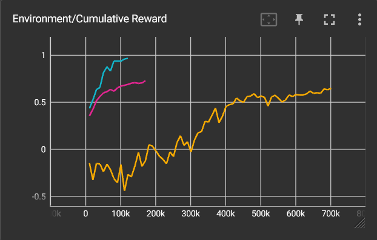

# Informe

1. [Apartados](#apartados)
    1. [Roller Ball](#roller-ball)
        1. [Tutorial](#tutorial)
        2. [Mejoras](#mejoras)
            1. [Cohete](#cohete)
            2. [Cohete v2](#cohete-v2)
    2. [Agente Plaza](#agente-plaza)

## Apartados

### Roller Ball

#### Tutorial

#### Mejoras

##### Cohete

Como los resultados del ejemplo me parecían ya bastante buenos, he decidido complicar un poco el problema limitando la capacidad de controlar el movimiento del objeto. He hecho que solo se pueda controlar la velocidad con la que se mueve hacia adelante (no se puede parar) y su velocidad de rotación en el eje Y. Básicamente, que se comporte como un mísil, pero que se desplaza pegado al suelo. Está implementado en **RocketAgent**.

Al ser más complejo y requerir ciertos cambios en el entorno, he hecho mútiples pruebas y entrenamientos. Todos los modelos resultantes están inlcuidos en el proyecto e indicaré cómo probar cada uno.

Al principio partí del entorno de la esfera tal cual y tan solo modifiqué el número de inputs y el efecto de las acciones del agente. Podemos ver sus resultados en las gráficas en color azul claro.

Tras hacer esta primera prueba, decidí modificar la función de recompensa para intentar hacer que el agente diera menos vueltas sobre si mismo como una peonza y se comportara más como un misil que va directo al objetivo. Para lograrlo, añadí dos factores a la recompensa final: El número de pasos que ha costado llegar al objetivo (en escala logarítmica para siempre incentivar el ir más rápido) y el número de vueltas que ha dado sobre el eje Y para llegar (1 si ha hecho una o menos).

Dividiendo la puntuación en base a estos factores podemos darle una "nota" sobre 1 a su éxito. El resultado de entrenar al cohete con estas recompensas es el siguiente (en fucsia): 

En un principio puede parecer que los resultados son mucho peores, pero tenemos que tener en cuenta que ya no estamos dando un 1 solo por llegar y que le estamos exigiendo mucho más. Si miramos la distribución de las recompensas esto queda mucho más claro.

Podemos ver que, al igual que en la original, muy pocos de los intentos acaban recibiendo un 0, pero que en este caso la distribución de las recompensas es mucho mayor, pero con una tendencia al alza muy similar a la original. Es decir, que el aparente empeoramiento del aprendizaje no es real. Pero, se ha conseguido realmente el objetivo?

A continuación se puede ver una comparativa en la duración de los episodios con ambos modelos y se puede apreciar considerablemente lo súmamente rápido que desciende en el nuevo modelo comparado con el anterior y la ausencia de picos pronunciados. En este sentido el experimento ha sido todo un éxito

Sin embargo, al probar el modelo, he podido comprobar que sigue haciendo lo mismo: dar vueltas como un trompo hasta coger los cubos. Es mucho más eficiente, pero no se comporta como el mísil que yo deseaba. Analizando su comportamiento, me he dado cuenta de que probablemente esto se debe a el rango limitado en el que aparecen los cubos y el hecho de que el lateral del cohete ofrece mayor superficie de contacto. Es decir, el problema es que en el entorno de entrenamiento que he creado esta es la estrategia más eficiente.

##### Cohete v2

Insatisfecha con los resultados, he continuado haciendo pruebas y modificando el agente hasta obtener el comportamiento deseado.

En primer lugar, lo que he hecho es limitar el número de vueltas que el agente da en un episodio, pues para llegar a su objetivo no necesita más de una y el quedarse dando vueltas sobre un mismo sitio es una forma común de que el agente se quede atascado sin caer o llegar al objetivo, lo que alarga innecesariamente los episodios. Especialmente en el nuevo escenario que es el doble de grande que el anterior.

Al ver que esto no era suficiente, he decidido atajar el problema de raíz haciendo que dar vueltas sea una forma mucho más ineficiente de desplazarse. He añadido un drag rotatorio proporcional a la velocidad para hacer más difícil el girar a gran velocidad y he añadido un arrastre lateral muy fuerte para impedir que se desplace derrapando (y simular el mayor arrastre que tiene un cohete yendo de lado debido a su mayor superficie).

Con estas mejoras, el cohete ya no hacía tantos círculos, pero como efecto secundario su efectividad bajó mucho. Así que revisé el funcionamiento interno del agente, puliendo un poco las entradas de las señales, haciendo que supiera tener en cuenta su velocidad angular, añadiendo otra capa de neuronas y mejorando la fórmula de la recompensa.

En esta fórmula he decidido penalizar al máximo el fallar por dar demasiadas vueltas(-1 de recompensa) ya que es mucho más perjudicial para mi objetivo que caerse (-0.5 de recompensa), pero luego les sumo hasta un 0.5 en base a lo cerca que han estado de su objetivo (en escala logarítmica).

En el caso de tener éxito, la fórmula anterior que se usaba para recompensar la velocidad y el no dar vueltas ahora solo suma hasta medio punto, ya que el otro medio punto se se recibe siempre porque corresponde a cuan cerca ha estado del objetivo.

El gráfico de recompensa acumulativa no es muy esclarecedor, pero si miramos la evolución de la distribución de recompensas podemos ver lo efectiva que ha sido su evolución

Debido al cambio en la fórmula podemos ver que hay una distribución de fallos mucho mayor pero que tiende a concentrarse cerca del -1 debido a la tendencia a dar vueltas sobre si mismo y a que es más fácil aprender a no caerse.

La distribución de éxitos es peor que la del [cohete](#cohete) original, pero esto probablemente sea debido al aumento de tamaño del área en la que puede aparecer el cubo que hace que se penalice más por tardar. Al menos esto es lo que sugiere

{: width=150 height=100 style="float:right; padding:16px"} 

### Agente Plaza

